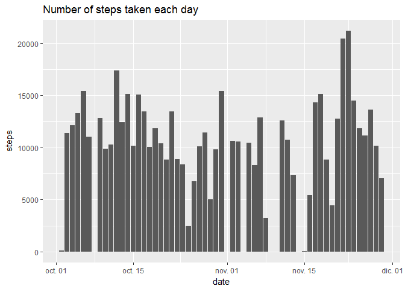
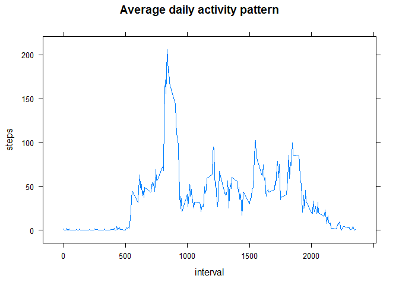
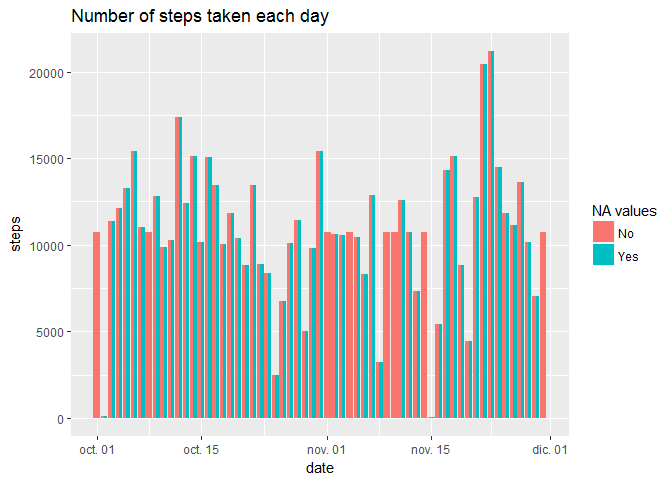
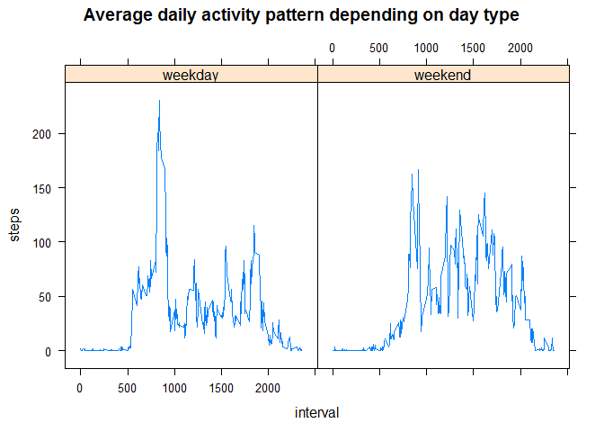

# Reproducible Research: Peer Assessment 1

<!-- Set working directory -->


## Loading and preprocessing the data
**Show any code that is needed to**

**1. Load the data (i.e. read.csv())**

```r
zip.file.name <- "activity.zip"
data.file.name <- "activity.csv"
data.file <- unz(zip.file.name, data.file.name)
activity.data <- read.csv(file = data.file, header=TRUE, sep=",")
```

**2. Process/transform the data (if necessary) into a format suitable for your analysis**


```r
activity.data$date <- as.Date(activity.data$date, "%Y-%m-%d") 
act.data.no.na <- activity.data[complete.cases(activity.data), ]
```

## What is mean total number of steps taken per day?
**For this part of the assignment, you can ignore the missing values in the dataset.**

**1. Calculate the total number of steps taken per day**

```r
steps.per.day <- aggregate(act.data.no.na$steps, by=list(date = act.data.no.na$date), FUN = sum)
names(steps.per.day) <- c("date", "steps")
```

**2. If you do not understand the difference between a histogram and a barplot, research the difference between them. Make a histogram of the total number of steps taken each day**

```r
library(ggplot2)
ggplot(data = steps.per.day, aes(date, steps)) + stat_summary(fun.y = sum, geom = "bar") + ggtitle("Number of steps taken each day")
```

<!-- -->

**3. Calculate and report the mean and median of the total number of steps taken per day**


```r
day.steps.mean <- format(mean(steps.per.day$steps), scientific=FALSE)
day.steps.median <- format(median(steps.per.day$steps), scientific=FALSE)
```

The mean of the steps taken in a day is 10766.19 while the median is 10765.

## What is the average daily activity pattern?
**1. Make a time series plot (i.e. type = "l") of the 5-minute interval (x-axis) and the average number of steps taken, averaged across all days (y-axis)**


```r
steps.per.interval <- aggregate(act.data.no.na$steps, by=list(interval = act.data.no.na$interval), FUN = mean)
names(steps.per.interval) <- c("interval", "steps")
library("lattice")
xyplot(steps ~ interval, data = steps.per.interval, type = "l", main="Average daily activity pattern")
```

<!-- -->

**2. Which 5-minute interval, on average across all the days in the dataset, contains the maximum number of steps?**


```r
interval.max.steps <- steps.per.interval[which.max(steps.per.interval$steps), ]$interval
interval.max.steps <- sprintf("%04d", interval.max.steps)
interval.max.steps <- format(strptime(interval.max.steps, format="%H%M"), format = "%H:%M")
```

The interval which contains the maximum number of steps is 08:35.

## Imputing missing values
**Note that there are a number of days/intervals where there are missing values (coded as NA). The presence of missing days may introduce bias into some calculations or summaries of the data.**

**1. Calculate and report the total number of missing values in the dataset (i.e. the total number of rows with NAs)**


```r
nrow.with.na <- nrow(activity.data[rowSums(is.na(activity.data)) > 0,])
```
The total number of rows with NAs is 2304.

**2. Devise a strategy for filling in all of the missing values in the dataset. The strategy does not need to be sophisticated. For example, you could use the mean/median for that day, or the mean for that 5-minute interval, etc.**

The strategy that I will use is filling the NA values in the steps variable with the mean of the corresponding interval.

**3. Create a new dataset that is equal to the original dataset but with the missing data filled in.**


```r
act.data.fill <- activity.data
for(i in 1:nrow(act.data.fill)) {
    cur.interval <- act.data.fill[i, ]$interval
    if(rowSums(is.na(act.data.fill[i, ])) > 0) {
        act.data.fill[i, ]$steps <- 
            steps.per.interval[steps.per.interval$interval == cur.interval, ]$steps
    }
  
}
head(act.data.fill)
```

```
##       steps       date interval
## 1 1.7169811 2012-10-01        0
## 2 0.3396226 2012-10-01        5
## 3 0.1320755 2012-10-01       10
## 4 0.1509434 2012-10-01       15
## 5 0.0754717 2012-10-01       20
## 6 2.0943396 2012-10-01       25
```

**4. Make a histogram of the total number of steps taken each day and Calculate and report the mean and median total number of steps taken per day. Do these values differ from the estimates from the first part of the assignment? What is the impact of imputing missing data on the estimates of the total daily number of steps?**


```r
steps.per.day.fill <- aggregate(act.data.fill$steps, by=list(date = act.data.fill$date), FUN = sum)
names(steps.per.day.fill) <- c("date", "steps")
steps.per.day.fill$NAval <- "No"
steps.per.day$NAval <- "Yes"
steps.per.day.both <- rbind(steps.per.day, steps.per.day.fill)
ggplot(data = steps.per.day.both, aes(x = date, y = steps, fill = NAval)) +
    geom_bar(stat ="identity", position = position_dodge()) +
    labs(title = "Number of steps taken each day",
         fill = "NA values") + xlab("date") +
    ylab("steps")
```

<!-- -->


```r
day.steps.mean.fill <- format(mean(steps.per.day.fill$steps), scientific=FALSE)
day.steps.median.fill <- format(median(steps.per.day.fill$steps), scientific=FALSE)
```

The mean of the steps taken in a day is 10766.19 with missing values and 10766.19 after filling the missing values.

The median is 10765 with missing values and 10766.19 after filling the missing values.

In the histogram we can see that almost nothing changes for the days that already had actual values whereas the 'empty' days are filled with values which leads to a very different results in these days.

The mean doesn't change, as we took the mean of the intervals to fill the missing values while the median is slightly higher in the data set where missing values have been filled.

## Are there differences in activity patterns between weekdays and weekends?
**For this part the weekdays() function may be of some help here. Use the dataset with the filled-in missing values for this part.**

**1. Create a new factor variable in the dataset with two levels - "weekday" and "weekend" indicating whether a given date is a weekday or weekend day.**


```r
act.data.fill$day.type <- ifelse(weekdays(act.data.fill$date) %in% c("sábado", "domingo"), "weekend", "weekday")
act.data.fill$day.type <- factor(act.data.fill$day.type)
head(act.data.fill)
```

```
##       steps       date interval day.type
## 1 1.7169811 2012-10-01        0  weekday
## 2 0.3396226 2012-10-01        5  weekday
## 3 0.1320755 2012-10-01       10  weekday
## 4 0.1509434 2012-10-01       15  weekday
## 5 0.0754717 2012-10-01       20  weekday
## 6 2.0943396 2012-10-01       25  weekday
```

**2. Make a panel plot containing a time series plot (i.e. type = "l") of the 5-minute interval (x-axis) and the average number of steps taken, averaged across all weekday days or weekend days (y-axis). See the README file in the GitHub repository to see an example of what this plot should look like using simulated data.**


```r
steps.per.interval.fill <- aggregate(steps ~ interval + day.type, data = act.data.fill, FUN = "mean")
xyplot(steps ~ interval | day.type, data = steps.per.interval.fill, type = "l", main="Average daily activity pattern depending on day type")
```

<!-- -->
